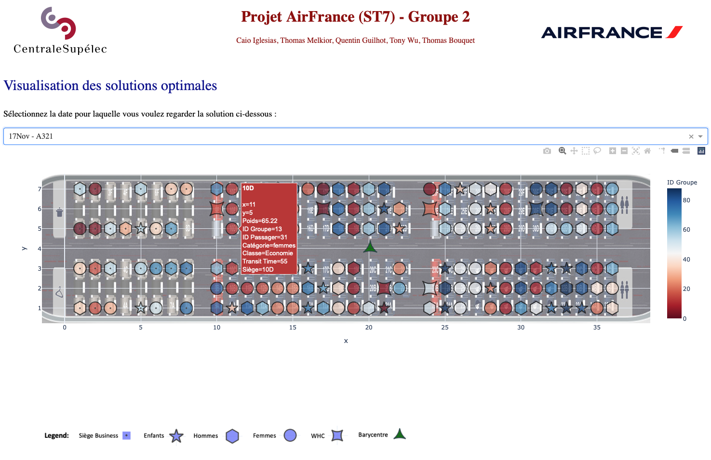
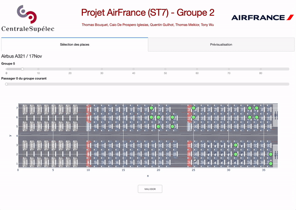

# Projet AirFrance - Placement de Passagers
Groupe 2 - Thomas Bouquet, Caio De Prospero Iglesias, Quentin Guilhot, Thomas Melkior, Tony Wu

[TOC]

## Introduction

Le projet présenté est un travail réalisé dans le cadre du cours d'Optimisation de Systèmes de Transport Passagers à CentraleSupélec.

Le *README* que vous lisez actuellement présente un bref aperçu de notre travail. Pour plus de détails, veuillez vous référer au rapport contenu dans le fichier `Rapport - Groupe 2.pdf`.

## Partie 1

### Objectif

- Le projet vise à résoudre un problème d'optimisation visant à placer des passagers dans un avion de ligne de telle sorte à maximiser la satisfaction client tout en respectant un lot de consignes de sécurité obligatoires
- Un second objectif est bien évidemment de résoudre le problème en un temps minimum.

Nous utiliserons pour cela le module *gurobi*.
​
​

### Présentation

Pour ce problème, on considère principalement un avion <strong>Airbus A320</strong> de la compagnie <strong>Air France</strong> dont l'organisation intérieure est présentée sur l'image suivante :

 

 
Il y a donc <strong>28 rangées</strong>, chacune possédant entre 2 et 6 sièges. Les dix premières rangées sont réservées à la classe Business (bien qu'on ne considère pas cette dernière dans la première instance de notre solution). Les issues de secours sont quant à elles situées aux rangées 11 et 12 (aucun enfant ne devra donc être assis sur un siège de l'une de ces deux rangées; mais encore une fois, cette contrainte ne s'appliquera pour les deuxième et troisième instances).

Toutefois, pour le vol du 8 novembre, un Airbus A320 est trop petit pour accueillir les 174 passagers. Pour cette date, on utilisera donc un <strong>Airbus A321</strong> dont le plan est présenté ci-dessous :
 

 

La cabine de cet avion est un peu plus complexe et est composé de <strong>34 rangées</strong> pour un total de 200 sièges.

### Méthode utilisée

Afin d'imager la méthode d'optimisation que nous avons inventée, nous avons choisi de l'appeler la méthode de **mise sous vide** à cause de sa similarité relative au principe de mise sous vide d'aliments. En effet, cette dernière se déroule au travers des étapes suivantes :

- on sélectionne les aliments que l'on souhaite mettre sous vide

- on les dispose dans un sachet aussi petit que possible mais pouvant tous les contenir

- on enlève les bulles d'air restantes.

  

### WebApp pour visualiser les résultats

Nous avons également implémenté une Web Application avec *Dash* pour permettre de visualiser aisément les résultats obtenus.

#### Instructions

Pour utiliser la WebApp associée au modèle statique, il faut :

> - Se mettre dans le répertoire `AirFrance-ST7`
> - Lancer `app_static.py` avec par exemple dans le terminal en lançant `python app_static.py`
> - Ouvrir dans un navigateur le lien affiché dans le terminal (commençant par *localhost*)

### Evaluation des performances de l'algorithme proposé

- Pour le critère de certificat d'optimalité, les résultats pour chaque instance sont automatiquement enregistrées dans le dossier `output`
- Pour le critère de rapidité, les temps de calcul sont stockées dans le dossier `logs` dans des fichiers texte nommés avec le timestamp du moment où le calcul a été réalisé.

Les temps de calcul obtenus lors de nos essais tournent autour de 2 secondes pour les petites instances et autour de 2 minutes pour les plus difficiles (sur nos ordinateurs portables).

## Partie 2

### Présentation

Dans la continuité du travail fait avec le modèle statique, nous développerons un modèle dit dynamique, plus proche de la réalité, dans lequel les passagers se verront offrir différents sièges lors de leur enregistrement afin d'en choisir un, tout en garantissant la faisabilité de la disposition des passagers dans la cabine vis-à-vis des contraintes et la non-dégradation de l'optimalité de ladite disposition en comparaison à celle obtenue via le modèle.

### Méthode utilisée

Pour le modèle dynamique, puisque nous connaissons à l'avance l'instance de vol, nous avons décidé de nous baser sur le modèle statique qui est l'une des possibilités optimales de placement et de proposer à chaque groupe courant une possibilité obtenue en commutant des groupes du modèle statique. En effet, le but du modèle dynamique est de simuler la réalité lorsque les passagers choisissent eux-mêmes leur siège parmi une liste de sièges proposés.

Très grossièrement, l'idée est de jouer sur les **permutations par agrégation, inter-groupes et inter-groupe** pour proposer à l'utilisateur plusieurs places qui résulteraient à une solution équivalente vis-à-vis des critères considérés dans le modèle statique.

### WebApp

#### Démonstration

#### Placement des passagers

#### Visualisation de l'instance en cours de complétion

#### Instructions

Pour utiliser le WebApp associée au modèle dynamique, il faut :

> - Lancer au préalable `livrable_2.ipynb` avec la date et l'avion voulus pour générer la solution dans le dossier `output` (automatiquement généré après avoir lancer toutes les cellules)
> - Se mettre dans le répertoire `AirFrance-ST7`
> - Lancer `app_dynamic.py` **en donnant en argument la date et l'avion** par exemple dans le terminal en lançant la commande `python app_dynamic 17Nov A321.py`
> - Ouvrir dans un navigateur le lien affiché dans le terminal (commençant par *localhost*)
> - On arrive sur l'interface sur l'onglet *Sélection des places*
> - Pour le passager indiqué par les deux sliders, sélectionner la place proposée en cliquant sur le point correspondant
> - Cliquer sur valider et si affichage de l'animation de chargement, attendre qu'il disparaisse (indique la fin des calculs)
> - Continuer ainsi de suite jusqu'à remplissage de l'avion
> - Pendant le remplissage, il est possible d'aller dans l'onglet *Prévisualisation* pour observer les placements de passager déjà réalisés.

## Notes de version

- v2.0
  - Release du 3ème rendu avec la partie dynamique
    - Modèle dynamique
    - WebApp de sélection et de prévisualisation des passagers
  - **Cahier des charges pour la 3ème partie :**
    - Offrir un maximum de choix de sièges
    - Atteinte des objectifs de base
    - Satisfaction client
    - Centrage de l’avion
    - Placement à l’avant des passagers en correspondance
    - Respect des contraintes supplémentaires
    - Placement spécial des passagers enfants, et des passagers à
    mobilité réduire
    - Ajout d’une cabine business
  
- v1.1
  - Ajout des images manquantes dans le Dash
- 1.0
  - Release du 2ème rendu avec la partie statique
  - **Cahier des charges pour la 2ème partie :**
    - Pas de choix de siège
    - Atteinte des objectifs de base
    - Satisfaction client
    - Centrage de l’avion
    - Placement à l’avant des passagers en correspondance
    - Respect des contraintes supplémentaires
    - Placement spécial des passagers enfants, et des passagers à mobilité réduire
    - Ajout d’une cabine business