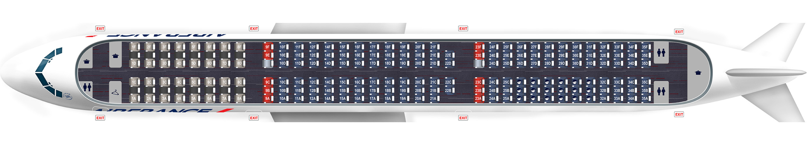

# Projet AirFrance - Placement de Passagers
​
Groupe 2 - Thomas Bouquet, Caio De Prospero Iglesias, Quentin Guilhot, Thomas Melkior, Tony Wu
​
​
​

​
​
​
## Objectif
​
- Le projet vise à résoudre un problème d'optimisation visant à placer des passagers dans un avion de ligne de telle sorte à maximiser la satisfaction client tout en respectant un lot de consignes de sécurité obligatoires
​
- Un second objectif est bien évidemment de résoudre le problème en un temps minimum
​
​
​
Nous utiliserons pour cela le module *gurobi*.
​
​
​
## Présentation
​
Pour ce problème, on considère principalement un avion <strong>Airbus A320</strong> de la compagnie <strong>Air France</strong> dont l'organisation intérieure est présentée sur l'image suivante :
 

 
Il y a donc <strong>28 rangées</strong>, chacune possédant entre 2 et 6 sièges. Les dix premières rangées sont réservées à la classe Business (bien qu'on ne considère pas cette dernière dans la première instance de notre solution). Les issues de secours sont quant à elles situées aux rangées 11 et 12 (aucun enfant ne devra donc être assis sur un siège de l'une de ces deux rangées; mais encore une fois, cette contrainte ne s'appliquera pour les deuxième et troisième instances).
​
Toutefois, pour le vol du 8 novembre, un Airbus A320 est trop petit pour accueillir les 174 passagers. Pour cette date, on utilisera donc un <strong>Airbus A321</strong> dont le plan est présenté ci-dessous :
 

 
La cabine de cet avion est un peu plus complexe et est composé de <strong>34 rangées</strong> pour un total de 200 sièges.
​
​
​
## Webapp pour visualiser les résultats
​
Nous avons également implémenté une Web Application avec *Dash* pour permettre de visualiser aisément les résultats obtenus. Pour l'utiliser, il faut :
​
> - Se mettre dans le répertoire `AirFrance-ST7`
> - Lancer `app.py` avec par exemple dans le terminal en lançant `python app.py`
> - Ouvrir dans un navigateur le lien affiché (commençant par *localhost*)
​
​
​
## Evaluation des performances de l'algorithme proposé
​
- Pour le critère de certificat d'optimalité, les résultats pour chaque instance sont automatiquement enregistrées dans le dossier `output`
- Pour le critère de rapidité, les temps de calcul sont stockées dans le dossier `logs` dans des fichiers texte nommés avec le timestamp du moment où le calcul a été réalisé.
​
​
​
Les temps de calcul obtenus lors de nos essais tournent autour de 30 secondes pour les petites instances et autour de 5 minutes pour les plus difficiles.
